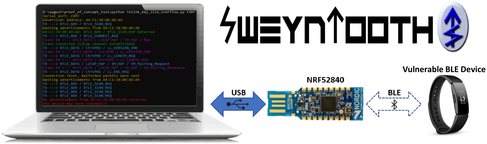
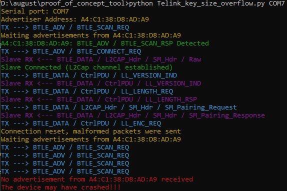
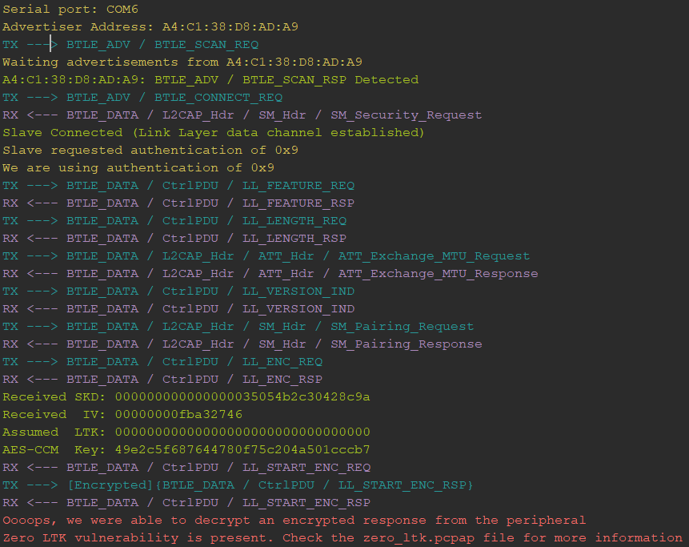
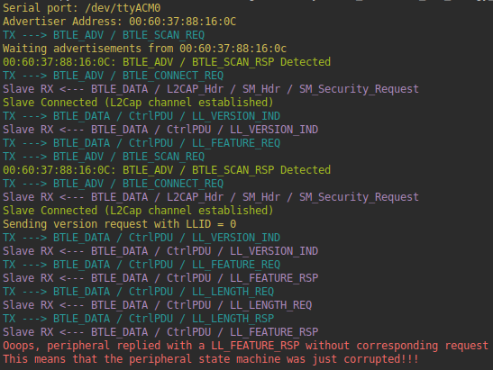
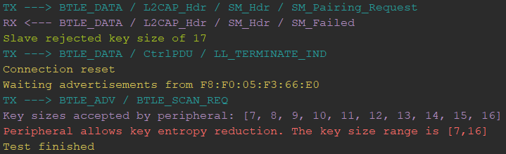

## SweynTooth - Unleashing Mayhem over Bluetooth Low Energy
**This repository is part of a research outcome from the [ASSET Research Group](https://asset-group.github.io/disclosures/sweyntooth/).**


SweynTooth captures a family of **12 vulnerabilities** (more under non-disclosure) across different Bluetooth Low Energy (BLE) software development kits (SDKs) of six major system-on-a-chip (SoC) vendors. The vulnerabilities expose flaws in specific BLE SoC implementations that allow an attacker in radio range to trigger **deadlocks, crashes** and **buffer overflows** or **completely bypass** **security** depending on the circumstances. **(Update) We have also included a testing script to check devices against the BLE KNOB variant**.

You can check more information about the vulnerabilities, **available patches** and affected devices on [ASSET Research Group SweynTooth disclosure website](https://asset-group.github.io/disclosures/sweyntooth/).

**Fitbit, August Smart Lock, Eve Energy, CubiTag** and other "Smart" things are affected.

* Fitbit Inspire Crash & CubiTag deadlock - https://www.youtube.com/watch?v=Iw8sIBLWE_w
* Eve Energy & August Smart Lock crash - https://www.youtube.com/watch?v=rge1XeJVpag&t=6s


#### Libraries included in this PoC

This PoC uses well maintained libraries such as [Scapy](https://github.com/secdev/scapy) and [Colorama](https://github.com/tartley/colorama). The BLE packet crafting and dissection is done via customized Scapy protocol layers ([bluetooth4LE](https://github.com/Matheus-Garbelini/sweyntooth_bluetooth_low_energy_attacks/blob/master/libs/scapy/layers/bluetooth4LE.py) and [bluetooth.py](https://github.com/Matheus-Garbelini/sweyntooth_bluetooth_low_energy_attacks/blob/master/libs/scapy/layers/bluetooth.py)). There's a [merge in progress](https://github.com/secdev/scapy/pull/2215) to include our additions in Scapy's main repository. 


### Getting Started (Installation)

First, you must make sure to have a **Python2.7** on your system. Secondly, SweynTooth uses the [Nordic nRF52840 Dongle](https://www.nordicsemi.com/?sc_itemid={CDCCA013-FE4C-4655-B20C-1557AB6568C9}) to send/receive raw link layer packets to and from the vulnerable peripheral over the air. It is necessary to flash the driver firmware to the board before starting the Python 2.7 scripts.

The binary of our firmware code is on the `nRF52_driver_firmware.zip` file. You need to install nrfutil tool to flash the firmware on the board. Remember to put the nRF52840 on DFU mode before flashing (reset the USB dongle while it is connected to your PC by pressing the reset button). You can run the following commands to install the Python dependencies and to flash the firmware:

```shell
python -m pip install nrfutil pyserial pycryptodome
nrfutil dfu usb-serial -p COM_PORT -pkg nRF52_driver_firmware.zip
```

The scripts work on Linux or Windows. You just need to change the `COM_PORT` parameter to match the nRF52840 port name.

##### (Alternative nRF52 driver flashing method)

You can alternatively flash the firmware by using the [nRF Connect App for Desktop](https://www.nordicsemi.com/Software-and-tools/Development-Tools/nRF-Connect-for-desktop), which gives a nice interface to flash the hex firmware (**nRF52_driver_firmware.hex**).

### Running the proof of concept scripts

After the requirements are installed, you can run an exploit script by executing the following command:

```shell
python Telink_key_size_overflow.py COM7 A4:C1:38:D8:AD:A9
```

The first argument is the serial port name (generally /dev/ttyACM0 on Linux) and the second is the address of the vulnerable BLE device. You can use any BLE scanner or the nRF Connect App to discover such address. 

Taking as example the Key Size Overflow vulnerability,  the following output is given by the script if the vulnerable device hangs after the crash:




### Docker image for Linux (optional)

If you wish to use SweynTooth via a docker image to avoid install Python dependencies, you can use the  `docker.sh` helper script to build and run the docker instance or download the prebuild docker image ([link](https://github.com/Matheus-Garbelini/sweyntooth_bluetooth_low_energy_attacks/releases)) available on releases page. The usage of `docker.sh` is described below.

```
---------  HELP -------------
sudo ./docker run <script_name> <serial_port> <ble_target_address> - Start any sweyntooth script by its name (<script_name>)
sudo ./docker build                                                - Build docker container
sudo ./docker build release                                        - Build docker container and create compressed image for release
sudo ./docker shell                                                - Start docker container shell
---------- EXAMPLE ----------
./docker.sh run extras/Microchip_and_others_non_compliant_connection.py /dev/ttyACM0 f0:f8:f2:da:09:63
```


#### Available BLE exploits

Each exploit script corresponds to one flaw. The following summary table captures the correspondence between the vulnerability and a script to exploit the vulnerability on the affected SoCs.

| Vulnerability              | CVE(s)                                                       | Vendor                                               | Script file                                                  |
| -------------------------- | ------------------------------------------------------------ | :--------------------------------------------------- | :----------------------------------------------------------- |
| Link Layer Length Overflow | [CVE-2019-16336](https://cve.mitre.org/cgi-bin/cvename.cgi?name=CVE-2019-16336)<br />[CVE-2019-17519](https://cve.mitre.org/cgi-bin/cvename.cgi?name=CVE-2019-17519) | Cypress<br />NXP                                     | [link_layer_length_overflow.py](link_layer_length_overflow.py) |
| LLID Deadlock              | [CVE-2019-17061](https://cve.mitre.org/cgi-bin/cvename.cgi?name=CVE-2019-17061)<br />[CVE-2019-17060](https://cve.mitre.org/cgi-bin/cvename.cgi?name=CVE-2019-17060) | Cypress<br />NXP                                     | [llid_dealock.py](llid_dealock.py)                           |
| Truncated L2CAP            | [CVE-2019-17517](https://cve.mitre.org/cgi-bin/cvename.cgi?name=CVE-2019-17517) | Dialog                                               | [DA14580_exploit_att_crash.py](DA14580_exploit_att_crash.py) |
| Silent Length Overflow     | [CVE-2019-17518](https://cve.mitre.org/cgi-bin/cvename.cgi?name=CVE-2019-17518) | Dialog                                               | [DA14680_exploit_silent_overflow.py](DA14680_exploit_silent_overflow.py) |
| Public Key Crash           | [CVE-2019-17520](https://cve.mitre.org/cgi-bin/cvename.cgi?name=CVE-2019-17520) | Texas Instruments                                    | [CC2640R2_public_key_crash.py](CC2640R2_public_key_crash.py) |
| Invalid Connection Request | [CVE-2019-19193](https://cve.mitre.org/cgi-bin/cvename.cgi?name=CVE-2019-19193) | Texas Instruments                                    | [CC_connection_req_crash.py](CC_connection_req_crash.py)     |
| Invalid L2CAP Fragment     | [CVE-2019-19195](https://cve.mitre.org/cgi-bin/cvename.cgi?name=CVE-2019-19195) | Microchip                                            | [Microchip_invalid_lcap_fragment.py](Microchip_invalid_lcap_fragment.py) |
| Sequential ATT Deadlock    | [CVE-2019-19192](https://cve.mitre.org/cgi-bin/cvename.cgi?name=CVE-2019-19192) | STMicroelectronics                                   | [sequential_att_deadlock.py](sequential_att_deadlock.py)     |
| Key Size Overflow          | [CVE-2019-19196](https://cve.mitre.org/cgi-bin/cvename.cgi?name=CVE-2019-19196) | Telink                                               | [Telink_key_size_overflow.py](Telink_key_size_overflow.py)   |
| Zero LTK Installation      | [CVE-2019-19194](https://cve.mitre.org/cgi-bin/cvename.cgi?name=CVE-2019-19194) | Telink                                               | [**Telink_zero_ltk_installation.py**](Telink_zero_ltk_installation.py) |
| DHCheck Skip               | [CVE-2020-13593](https://cve.mitre.org/cgi-bin/cvename.cgi?name=CVE-2020-13593) | Texas Instruments                                    | [**non_compliance_dhcheck_skip.py**](extras/non_compliance_dhcheck_skip.py) |
| ESP32 HCI Desync           | [CVE-2020-13595](https://cve.mitre.org/cgi-bin/cvename.cgi?name=CVE-2020-13595) | Espressif Systems                                    | [**esp32_hci_desync.py**](esp32_hci_desync.py)               |
| Zephyr Invalid Sequence    | [CVE-2020-10061](https://cve.mitre.org/cgi-bin/cvename.cgi?name=CVE-2020-10061) | Zephyr Project                                       | [**zephyr_invalid_sequence.py**](zephyr_invalid_sequence.py) |
| Invalid Channel Map        | [CVE-2020-10069](https://cve.mitre.org/cgi-bin/cvename.cgi?name=CVE-2020-10069)<br />[CVE-2020-13594](https://cve.mitre.org/cgi-bin/cvename.cgi?name=CVE-2020-13594) | Zephyr Project<br />Espressif Systems<br />Microchip | [**invalid_channel_map.py**](invalid_channel_map.py)         |

Generally, products using the affected SoCs employ a watchdog to automatically restart the BLE SoC in the case a fault occurs, hence not all products can be deadlocked. Nevertheless, it should be possible to get some visual or audio indication from the product if the same crashes and restarts.


#### Zero LTK Installation ([CVE-2019-19194](https://cve.mitre.org/cgi-bin/cvename.cgi?name=CVE-2019-19194))

The most critical SweynTooth vulnerability is the Zero LTK Installation which allows an attacker to fully bypass the latest Bluetooth pairing procedure (secure connections) by forcing an encryption setup procedure with a zero filled LTK. In order to test your device against this vulnerability, the device must accept or support secure connections as pairing method. You can run the PoC as follows:

```shell
python Telink_zero_ltk_installation.py COM7 A4:C1:38:D8:AD:A9
```

Note that the arguments ` COM7 ` and `A4:C1:38:D8:AD:A9` are different based on your setup. If the device is vulnerable, the PoC outputs the following:




#### LLID Deadlock (CVE-2019-17060/1)

The LLID deadlock script clears the LLID field when sending both version request or pairing requests in an alternative manner on each re-connection with the peripheral. This is done to to trigger the vulnerability in both NXP and Cypress vulnerable SoCs. When runnig the script against the vulnerable KW41Z, the stack is deadlocked and should send out of order Link Layer packets. The script tries to detect when the stack is deadlocked and outputs the following for vulnerable KW41Z devices:



Vulnerable Cypress devices generally disable advertisements after the attack. Therefore you should see an error message indicating that a crash has been detected. When testing this script against a vulnerable Fitbit Inspire, the smartwatch either crashes immediately or disable its advertisements temporarily. Intermittent attacks against this device should cause a permanent BLE malfunction, requiring the user to manually reboot Fitbit inspire.

### KNOB Tester (Bluetooth Low Energy variant)

While KNOB mainly affected Bluetooth Classic devices due to the key size being reduced to 1 byte, it's still possible to reduce the key entropy of Bluetooth Low Energy devices to 7 bytes (minimum compliant key size) during the SMP pairing procedure. The implication of such compliant BLE entropy reduction was discussed in  ["Low Entropy Key Negotiation Attacks on Bluetooth and Bluetooth Low Energy" by Antonioli, Daniele et. al](https://www.semanticscholar.org/paper/Low-Entropy-Key-Negotiation-Attacks-on-Bluetooth-Antonioli-Tippenhauer/5a4581fefbd7fabd2812efe5534e6866f19d7aa5).

We have made available a simple script to check what key sizes are acceptable by a BLE peripheral device. You can run the BLE KNOB tester as follows:

```shell
# Windows
python extras\knob_tester_ble.py COM6 a4:c1:38:d8:ad:a9
# Linux
python extras/knob_tester_ble.py /dev/ttyACM0 a4:c1:38:d8:ad:a9
```

Do not forget to change the COM6 and a4:c1:38:d8:ad:a9 to other values according to the nRF52 dongle serial port (usually /dev/ttyACM0 on Linux) and the address of the BLE device under test. If the tool detects the peripheral to accept other key sizes other than 16 bytes, it will list them as shown below:




### Captures

The folder **captures** contains some sample captures of each vulnerability. We have also added some noncompliance cases detected in some SoCs.


### Extras

The [extras folder](extras/) contains some additional scripts related to non-compliances and some SweynTooth variants. Check the table of extras scripts on [extras/README.md](extras/README.m) for more information.


### Acknowledgements
**This research was partially supported by [Keysight Technologies](https://www.keysight.com/sg/en/home.html).**
* [Scapy](https://github.com/secdev/scapy) - Packet manipulation library.
* [Colorama](https://github.com/tartley/colorama) - Cross-platform coloured terminal text in Python.
