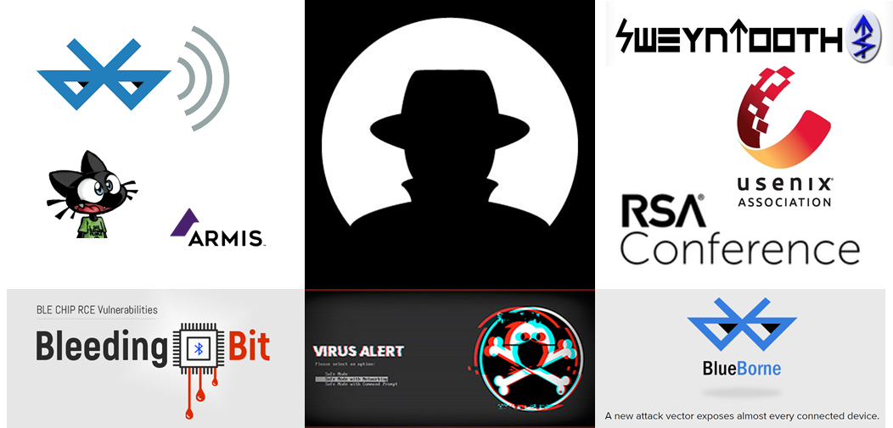
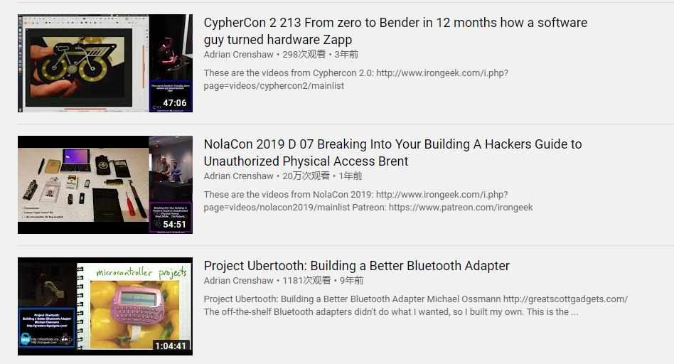

# Bluetooth LE-Security: method, tools and stack

 

 

<h1>Bluetooth LE Vulnerability</h1>
	<table>
	<tbody>
		<tr>
			<td>1.</td>
			<td>
<iframe width="320" height="180" src="https://www.youtube.com/embed/WWQTlogqF1I" frameborder="0" allow="accelerometer; autoplay; clipboard-write; encrypted-media; gyroscope; picture-in-picture" allowfullscreen></iframe>
</td>
			<td>
				
<b>BlueBorne</b>: A New Class of Airborne Attacks that can Remotely Compromise Any Linux/IoT Device
				 
				<b>Ben Seri</b> & <b>Gregory Vishnepolsky </b>

				
In this talk we will present the ramifications of airborne attacks, which bypass all current security measures and provide hackers with a contagious attack, capable of jumping over "air-gapped" networks...

				
 Black Hat 2017
				 
				[<b><a href="https://www.armis.com/blueborne/" target="_blank">PDF</a></b> | <a href="https://github.com/Charmve/BLE-Security-Attack-Defence/tree/master/01_BlueBorne" target="_blank"><b>Project Page</b></a> |  <a href="https://www.youtube.com/watch?v=WWQTlogqF1I" target="_blank"><b>Video</b></a>]
				

			</td>
		</tr>
		 
		<tr>
			<td>2.</td>
			<td>
<iframe width="320" height="180" src="https://www.youtube.com/embed/G08fh5Sa7TU" frameborder="0" allow="accelerometer; autoplay; clipboard-write; encrypted-media; gyroscope; picture-in-picture" allowfullscreen></iframe>
</td>
			<td>
				
<b>BtleJuice</b>: the Bluetooth Smart Man In The Middle Framework 
				 
				<b>Damiel Cauquil

				
A lot of Bluetooth Low Energy capable devices are spread since the last few years, offering a brand new way to compromise many “smart” objects: fitness wristbands, smart locks and padlocks and even healthcare devices. But this protocol poses some new challenges...
				

				
<i> DefConference 2016 (<b>DEFCOON</b>) </i>
				 
				[<a href="https://www.youtube.com/watch?v=G08fh5Sa7TU" target="_blank"><b>Video</b> | </a><a href="https://speakerdeck.com/virtualabs/btlejuice-the-bluetooth-smart-mitm-framework?slide=40" target="_blank"><b>PDF</b></a> | <a href="https://github.com/Charmve/BLE-Security-Attack-Defence/tree/master/04_BtleJuice" target="_blank"><b>Project Page</b></a>]

			</td>
		</tr>
		 
		<tr>
			<td>3.</td>
			<td>
<iframe width="320" height="180" src="https://www.youtube.com/embed/WWQTlogqF1I" frameborder="0" allow="accelerometer; autoplay; clipboard-write; encrypted-media; gyroscope; picture-in-picture" allowfullscreen></iframe>
</td>
			<td>
				
You had better secure your BLE devices 
				 
				<b>Damiel Cauquil</b> 

				
Sniffing and attacking Bluetooth Low Energy devices has always been a real pain. Proprietary tools do the job but cannot be tuned to fit our offensive needs, while opensource tools work sometimes, ...  

				
<i> DefConference 2018 (<b>DEFCOON26</b>) </i>
				 
				[<b><a href="https://github.com/Charmve/BLE-Security-Attack-Defence/tree/master/04_BtleJuice" target="_blank">PDF</a></b> | <a href="https://github.com/Charmve/BLE-Security-Attack-Defence/tree/master/04_BtleJuice" target="_blank"><b>Project Page</b></a> | <a href="https://www.youtube.com/watch?v=VHJfd9h6G2s" target="_blank"><b>Video</b></a>]

			</td>
		</tr>
		 
		<tr>
			<td>4.</td>
			<td>
<iframe width="320" height="180" src="https://www.youtube.com/embed/D5FIIqLWtYw?list=PLKV_4pHyTj0GUtdyOZotJJFwsjHbBT83l" frameborder="0" allow="accelerometer; autoplay; clipboard-write; encrypted-media; gyroscope; picture-in-picture" allowfullscreen></iframe>
</td>
			<td>
				
<b>BLEEDINGBIT </b>- Takeover of Aruba Access Point Access Point 325 
				 
				<b>Armis</b>

				
In this demo, Armis will demonstrate the takeover of an Aruba Access Point Access Point 325 using a TI cc2540 BLE chip. For more information, please visit https://armis.com/bleedingbit.

				
<i> BLEEDINGBIT RCE vulnerability (CVE-2018-16986) </i>
				 
				[<b><a href="https://www.armis.com/bleedingbit/" target="_blank">PDF</a></b> | <a href="https://github.com/Charmve/BLE-Security-Attack-Defence/tree/master/02_BLEEDINGBIT" target="_blank"><b>Project Page</b></a>  | <a href="https://www.youtube.com/watch?v=D5FIIqLWtYw&list=PLKV_4pHyTj0GUtdyOZotJJFwsjHbBT83l&index=2" target="_blank"><b>Video</b></a>]

			</td>
		</tr>
		 
		<tr>
			<td>5.</td>
			<td>
<iframe width="320" height="180" src="https://www.youtube.com/embed/oty1yTdsEXs" frameborder="0" allow="accelerometer; autoplay; clipboard-write; encrypted-media; gyroscope; picture-in-picture" allowfullscreen></iframe>
</td>
			<td>
				
<b>SweynTooth</b>: Unleashing Mayhem over Bluetooth Low Energy 
				 
				<b>Matheus E. Garbelini</b>

				
The Bluetooth Low Energy (BLE) is a promising short-range communication technology for Internet-of-Things (IoT) with reduced energy consumption. Vendors implement BLE protocols in their manufactured devices compliant to Bluetooth Core Specification. Recently, several vulnerabilities were discovered in the BLE protocol ...
				

				
<i> <b>USENIX Security</b></i>
				 
				[<b><a href="https://www.usenix.org/conference/atc20/presentation/garbelini" target="_blank">PDF</a></b> | <a href="https://github.com/Charmve/BLE-Security-Attack-Defence/tree/master/03_SweynTooth" target="_blank"><b>Project Page</b></a>  | <a href="https://www.youtube.com/watch?v=oty1yTdsEXs" target="_blank"><b>Video</b></a>]

			</td>
		</tr>
		 
		<tr>
			<td>6.</td>
			<td>
<iframe width="320" height="180" src="https://www.youtube.com/embed/wIWZaSZsRc8" frameborder="0" allow="accelerometer; autoplay; clipboard-write; encrypted-media; gyroscope; picture-in-picture" allowfullscreen></iframe>
</td>
			<td>
				
<b>BLESA</b>:  Spoofing Attacks against Reconnections in Bluetooth Low Energy 			
			 
				<b>Jianliang Wu, Yuhong Nan ..., Purdue University</b>

				
In this paper, we analyze the security of the BLE link-layer, focusing on the scenario in which two previously-connected devices reconnect. Based on a formal analysis of the reconnection procedure defined by the BLE specification, we highlight two critical security weaknesses in the specification. As a result, even a device implementing the BLE protocol correctly may be vulnerable to spoofing attacks...
				

				
<i> <b>WOOT '20</b></i>
				 
				[<b><a href="https://www.usenix.org/conference/woot20/presentation/wu" target="_blank">PDF</a></b> | <a href="https://github.com/Charmve/mhaiyang.github.io/blob/master/ICME2020_MCERN/index.html" target="_blank"><b>Project Page</b></a>  | <a href="https://www.youtube.com/watch?v=wIWZaSZsRc8" target="_blank"><b>Video</b></a>]

			</td>
		</tr>
		 
		<tr>
			<td>7.</td>
			<td>
<iframe width="320" height="180" src="https://www.youtube.com/embed/uKqdb4lF0XU" frameborder="0" allow="accelerometer; autoplay; clipboard-write; encrypted-media; gyroscope; picture-in-picture" allowfullscreen></iframe>
</td>
			<td>
				
<b>Gattacking Bluetooth Smart Devices</b> - Introducing a New BLE Proxy Tool 
				 
				<b>Slawomir Jasek</b>

				
Using a few simple tricks, we can assure the victim will connect to our impersonator device instead of the original one, and then just proxy the traffic - without consent of the mobile app or device. And here it finally becomes interesting - just imagine how many attacks you might be able to perform with the possibility to actively intercept the BLE communication....

				
<i> Black Hat 2016 (<b>Black Hat</b>) </i>
				 
				

			</td>
		</tr>
		 
		<tr>
			<td>8.</td>
			<td>
<iframe width="320" height="180" src="https://www.youtube.com/embed/iH7VPUNz-dU" frameborder="0" allow="accelerometer; autoplay; clipboard-write; encrypted-media; gyroscope; picture-in-picture" allowfullscreen></iframe>
</td>
			<td>
				
<b>BLEKey</b>: Breaking Access Controls With BLEKey 
				 
				<b> Eric Evenchick</b>  &  <b>Mark Baseggio</b>

				
RFID access controls are broken. In this talk, we will demonstrate how to break into buildings using open-source hardware we are releasing.Over the years, we have seen research pointing to deficiencies in every aspect of access control systems: the cards...
				

				
<i> Black Hat 2016 (<b>Black Hat</b>) </i>
				 
				[<b><a href="" target="_blank">PDF</a></b> | <a href=" " target="_blank"><b>Project Page</b></a>  | <a href="https://www.youtube.com/embed/iH7VPUNz-dU" target="_blank"><b>Video</b></a>]

			</td>
		</tr>
		 
		<tr>
			<td>9.</td>
			<td>
<iframe width="320" height="180" src="https://www.youtube.com/embed/s79CG2Os0Nc" frameborder="0" allow="accelerometer; autoplay; clipboard-write; encrypted-media; gyroscope; picture-in-picture" allowfullscreen></iframe>
</td>
			<td>
				
<b>MASHaBLE</b>: Mobile Applications of Secret Handshakes Over Bluetooth LE 
				 
				<b>Yan Michalevsky</b>

				
n this talk, we present new applications for cryptographic secret handshakes between mobile devices on top of Bluetooth Low-Energy (LE). Secret handshakes enable mutual authentication between parties that did not meet before (and therefore don't trust each other) but are both associated with a virtual secret group or community...
				

				
<i> Black Hat 2016 (<b>Black Hat</b>) </i>
				 
				[<b><a href="https://www.blackhat.com/docs/asia-17/materials/asia-17-Michalevsky-MASHABLE-Mobile-Applications-Of-Secret-Handshakes-Over-Bluetooth-LE-wp.pdf" target="_blank">PDF</a></b> | <a href="https://www.blackhat.com/asia-17/briefings.html#mashable-mobile-applications-of-secret-handshakes-over-bluetooth-le" target="_blank"><b>Project Page</b></a>  | <a href="https://www.youtube.com/watch?v=s79CG2Os0Nc" target="_blank"><b>Video</b></a>]

			</td>
		</tr>
				 
		<tr>
			<td>10.</td>
			<td>
<iframe width="320" height="180" src="https://www.youtube.com/embed/X2ARyfjzxhY" frameborder="0" allow="accelerometer; autoplay; clipboard-write; encrypted-media; gyroscope; picture-in-picture" allowfullscreen></iframe>
</td>
			<td>
				
<b>Safe Mode Wireless Village</b> - The Basics Of Breaking BLE v3 
				 
				<b> FreqyXin</b>

				
Evolving over the past twenty-two years, Bluetooth, especially Bluetooth Low Energy (BLE), has become the ubiquitous backbone ...
				

				
<i> DefConference 2020 (<b>DEFCOON</b>) </i>
				 
				[<b><a href=" " target="_blank">PDF</a></b> | <a href=" " target="_blank"><b>Project Page</b></a>  | <a href="https://www.youtube.com/watch?v=X2ARyfjzxhY" target="_blank"><b>Video</b></a>]

			</td>
		</tr>
		 
		<tr>
			<td>11.</td>
			<td>
<iframe width="320" height="180" src="https://www.youtube.com/embed/s79CG2Os0Nc" frameborder="0" allow="accelerometer; autoplay; clipboard-write; encrypted-media; gyroscope; picture-in-picture" allowfullscreen></iframe>
</td>
			<td>
				
<b>MASHaBLE</b>: Mobile Applications of Secret Handshakes Over Bluetooth LE 
				 
				<b>Yan Michalevsky</b>

				
In this talk, we present new applications for cryptographic secret handshakes between mobile devices on top of Bluetooth Low-Energy (LE). Secret handshakes enable mutual authentication between parties that did not meet before (and therefore don't trust each other) but are both associated with a virtual secret group or community...
				

				
<i> Black Hat 2016 (<b>Black Hat</b>) </i>
				 
				[<b><a href="https://www.blackhat.com/docs/asia-17/materials/asia-17-Michalevsky-MASHABLE-Mobile-Applications-Of-Secret-Handshakes-Over-Bluetooth-LE-wp.pdf" target="_blank">PDF</a></b> | <a href="https://www.blackhat.com/asia-17/briefings.html#mashable-mobile-applications-of-secret-handshakes-over-bluetooth-le" target="_blank"><b>Project Page</b></a>  | <a href="https://www.youtube.com/watch?v=s79CG2Os0Nc" target="_blank"><b>Video</b></a>]

			</td>
		</tr>
		 
		<tr>
			<td>12.</td>
			<td>
<iframe width="320" height="180" src="https://www.youtube.com/embed/gCQ3iSy6R-U" frameborder="0" allow="accelerometer; autoplay; clipboard-write; encrypted-media; gyroscope; picture-in-picture" allowfullscreen></iframe>
</td>
			<td>
				
Bluetooth Reverse Engineering: Tools and Techniques
				 
				<b>Mike Ryan, Founder</b>, ICE9 Consulting
				
With the continuing growth of IoT, more and more devices are entering the market with Bluetooth. This talk will shed some light on how these devices use Bluetooth and will cover reverse engineering techniques that in many cases can be accomplished with hardware you already have! Whether you're a Bluetooth newbie or a seasoned pro, you’ll learn something from this talk....
				

				
<i> RSA Conference</i>
				 
				[<b><a href="https://www.blackhat.com/docs/asia-17/materials/asia-17-Michalevsky-MASHABLE-Mobile-Applications-Of-Secret-Handshakes-Over-Bluetooth-LE-wp.pdf" target="_blank">PDF</a></b> | <a href="https://www.blackhat.com/asia-17/briefings.html#mashable-mobile-applications-of-secret-handshakes-over-bluetooth-le" target="_blank"><b>Project Page</b></a>  | <a href="https://www.youtube.com/watch?v=gCQ3iSy6R-U" target="_blank"><b>Video</b></a>]

			</td>
		</tr>
	</table>
	</tbody>
 
 

    

 

0. BlueBorne - A New Class of Airborne Attacks that can Remotely Compromise Any Linux/IoT Device
https://www.youtube.com/watch?v=WWQTlogqF1I

   Hack.lu 2016 BtleJuice: the Bluetooth Smart Man In The Middle Framework by Damiel Cauquil
https://www.youtube.com/watch?v=G08fh5Sa7TU

1. MASHaBLE: Mobile Applications of Secret Handshakes Over Bluetooth LE
https://www.youtube.com/watch?v=s79CG2Os0Nc
2. Automatic Discovery of Evasion Vulnerabilities Using Targeted Protocol Fuzzing 
https://www.youtube.com/watch?v=NDWGwrMk3AU
3. Hacking the Wireless World with Software Defined Radio - 2.0
https://www.youtube.com/watch?v=MKbU3HhG2vk
4. Effective File Format Fuzzing – Thoughts, Techniques and Results
https://www.youtube.com/watch?v=qTTwqFRD1H8
5. Hacking the Wireless World with Software Defined Radio - 2.0
https://www.youtube.com/watch?v=x3UUazj0tkg

 
6. DEF CON 26 - Damien virtualabs Cauquil - You had better secure your BLE devices
https://www.youtube.com/watch?v=VHJfd9h6G2s&t=646s
7. DEF CON 24 Wireless Village - Jose Gutierrez and Ben Ramsey - How Do I BLE Hacking
https://www.youtube.com/watch?v=oP6sx2cObrY
8. DEF CON Safe Mode Wireless Village - FreqyXin - The Basics Of Breaking 

https://www.youtube.com/watch?v=X2ARyfjzxhY
9. DEF CON 26 - Vincent Tan - Hacking BLE Bicycle Locks for Fun and a Small Profit
https://www.youtube.com/watch?v=O-caTVpHWoY
10. DEF CON 26 WIRELESS VILLAGE - ryan holeman - BLE CTF
https://www.youtube.com/watch?v=lx5MAOyu9N0

11. DEF CON 21 - Ryan Holeman - The Bluetooth Device Database
https://www.youtube.com/watch?v=BqiIERArnA8
12. DEF CON 22 - Grant Bugher - Detecting Bluetooth Surveillance Systems
https://www.youtube.com/watch?v=85uwy0ACJJw

13. KnighTV Episode 11: Hacking BLe Devices Part 1/6: Attacking August Smart Lock Pro
https://www.youtube.com/watch?v=3e4DBk5BKLg
14. Gattacking Bluetooth Smart Devices - Introducing a New BLE Proxy Tool
https://www.youtube.com/watch?v=uKqdb4lF0XU&list=LLxFkZjbpt0KyhEv1d342SQQ&index=6&t=91s
15. Bluetooth Reverse Engineering: Tools and Techniques
https://www.youtube.com/watch?v=gCQ3iSy6R-U
16. Hopping into Enterprise Networks from Thin Air with BLEEDINGBIT
https://www.youtube.com/watch?v=ASod9cRtZf4

   漏洞预警 | BleedingBit蓝牙芯片远程代码执行漏洞 
https://www.anquanke.com/post/id/163307  https://www.secpulse.com/archives/78841.html

17. BA03 Breaking the Teeth of Bluetooth Padlocks Adrian Crenshaw
https://www.youtube.com/watch?v=k8Tp5hj6ylY
18. The NSA Playset Bluetooth Smart Attack Tools
https://www.youtube.com/watch?v=_Z4gYyrKVFM
